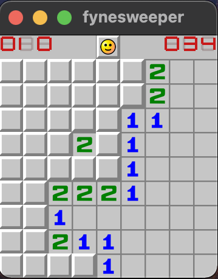

# fynesweeper
A clone of the popular game - "Minesweeper", made using the [Fyne toolkit](https://fyne.io/).
<p align="center">
    
</p>

### Features
* Create a game with Beginner, Intermediate or Expert difficulty
* Left click to reveal a tile, right click to flag it
* Counter on the left counts the number of mines remaining (unflagged)
* Counter on the right tracks the time sincethe start of the game
* Smiley-man in the center controls everything :)

### Building the app locally
Clone the repo to your machine and run this command inside the folder
```
$ make build
```
This will create an executable in the `bin` folder in the repo.

### Roadmap
* Beautify the top bar to have a more authentic look
* Create custom difficulty game
* Save game stats locally
* Save game preferences locally
* 'About' screen to show info about the app
* Create downloadable builds for desktop (windows, macOS, linux)
* Mobile friendly version